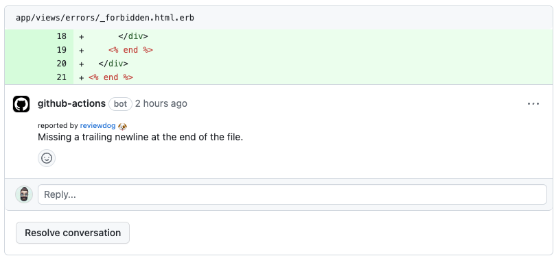
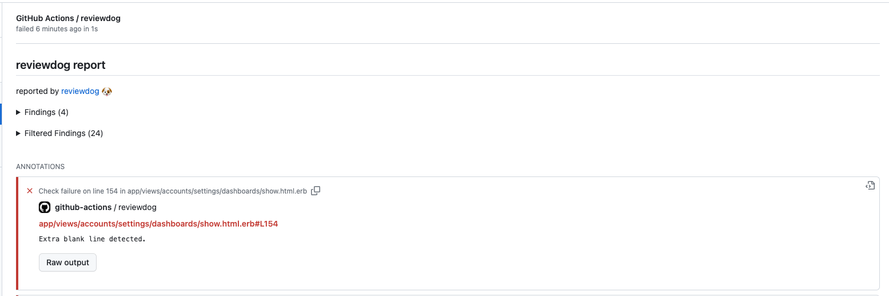

# GitHub Action: Run erb_lint with reviewdog 🐶

This Github action runs [erb_lint](https://github.com/Shopify/erb-lint) with [reviewdog](https://github.com/reviewdog/reviewdog). 

## Examples

```yml
name: reviewdog
on: [pull_request]
jobs:
  linters:
    name: runner / linters
    runs-on: ubuntu-latest
    steps:
      - name: Check out code
        uses: actions/checkout@v3
      - name: Set up Ruby
        uses: ruby/setup-ruby@v1
        with:
          ruby-version: 3.2.2
      - name: erb_lint
        uses: WizardComputer/action-erblint@v1
        with:
          reporter: github-pr-check # Default is github-pr-review
```

### With `github-pr-review`

By default, with `reporter: github-pr-review` a comment is added to the Pull Request Conversation:



### With `github-pr-check`

With `reporter: github-pr-check` an annotation is added to the line:




## Inputs

### `github_token`

`GITHUB_TOKEN`. Default is `${{ github.token }}`.

### `erblint_version`

Optional. Set erb_lint version. 
* empty or omit: install latest version
* `gemfile`: install version from Gemfile (`Gemfile.lock` should be presented, otherwise it will fallback to latest bundler version)
* version (e.g. `0.4.0`): install said version

### `level`

Optional. Report level for reviewdog [`info`, `warning`, `error`].
It's same as `-level` flag of reviewdog.

### `reporter`

Optional. Reporter of reviewdog command [`github-pr-check`, `github-pr-review`, `github-check`].
The default is `github-pr-review`.

### `filter_mode`

Optional. Filtering mode for the reviewdog command [`added`, `diff_context`, `file`, `nofilter`].
Default is `added`.

### `use_bundler`

Optional. Run Rubocop with bundle exec. Default: false.


